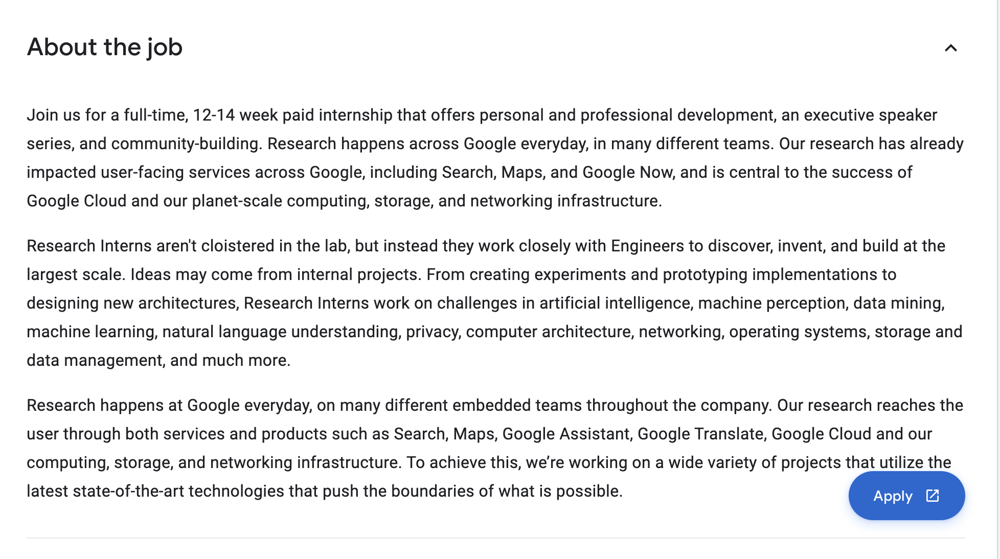
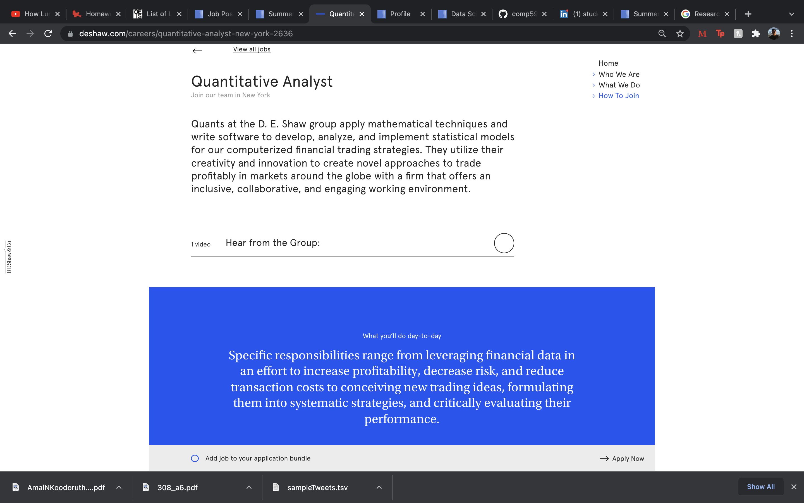
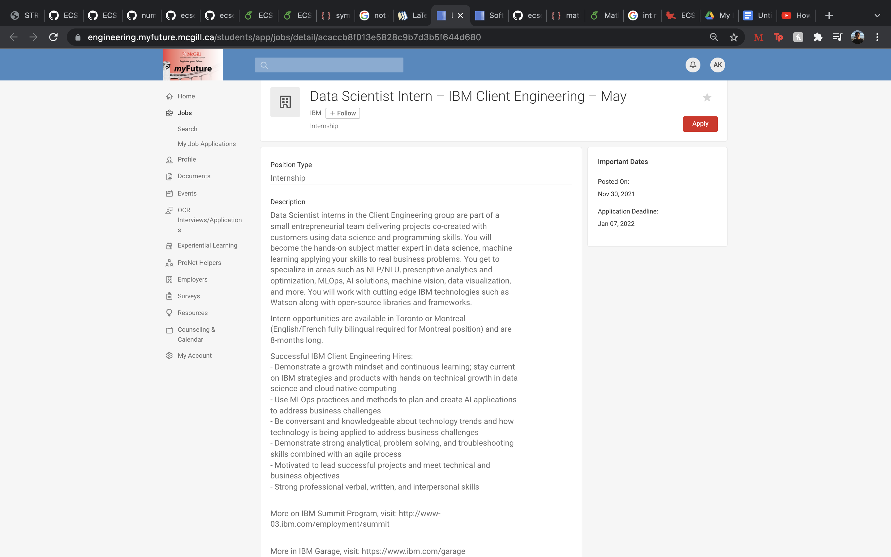

# Task 1: Data Science Careers

Insert the job descriptions here (links, info, etc) and the images.
## Google
https://careers.google.com/jobs/results/99898757081899718-research-intern-bs-summer-2022/?src=Online%2FLinkedIn%2Flinkedin_us&utm_campaign=contract&utm_medium=jobposting&utm_source=linkedin

## D.E. Shaw
https://engineering.myfuture.mcgill.ca/students/app/jobs/detail/f81d20344d6398de85cc533030e0ab40

## IBM
https://engineering.myfuture.mcgill.ca/students/app/jobs/detail/acaccb8f013e5828c9b7d3b5f644d680#jobact.apply=1

After some research, I found the above 3 jobs for which I actually just applied. I'm not sure if it was a good idea to apply right now though since I haven't added the projects I'm doing this semester on my resume yet, but that's not the point of this assignment...

Despite majoring in electrical engineering, which is quite physics-heavy, I am passionate about data science, machine learning and mathematics. I think that the above-mentioned  jobs combine at least two if these fields, and I would love taking any one of these jobs. We all know that there is plenty of data out there, but we need to be able to make sense out of it. And I want to be the person that does that! I love the way we derive insights from data; the whole process is in fact very satisfying, from fetching raw data, cleaning it, analyzing and interpreting it (I LOVE statistics). Other than the very appealing job descriptions, I feel that it would be great for me to see what life is like in a research environment at a tech giant, or in an investment bank or in a big tech company. It would actually be an opportunity for me to grow.

# Task 2: Highs and Lows

It's a great class, really. It's just the bokeh assignment that was super hard (actually I didn't complete it and I really hope that it's not fatal to my grade). I believe that Derek is 100% correct the way he structured the course. It would have been so less interesting if we were just given the material on a silver platter. And he's completely right when he said that we need to develop that "research" skill. But frankly, we already do that with most of our courses (despite the fact that the respective profs "cover the exact material in class").

I have enjoyed that class, despite some long assignments. I was actually expecting a last coding assignment, pour finir en beauté. But it's fine I'm not complaining :D. Before the start of the semester I wanted to experiment with that course, I was more into machine learning actually. But it made me realize that the whole data science journey is much more interesting and more satisfying, because at the end we  evaluate the impact by carrying out analysis, and this helps us really understand things in real life.

It is with a heavy heart that I am writing this last assignment. Thank you Derek and all the AMAZING TAs for this semester, I enjoyed COMP 598! I really hope it's not the last time we hear of each other. Thank you again and good luck to you guys in your research <3
